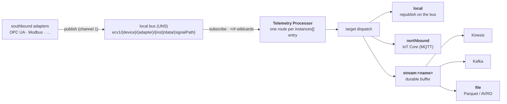
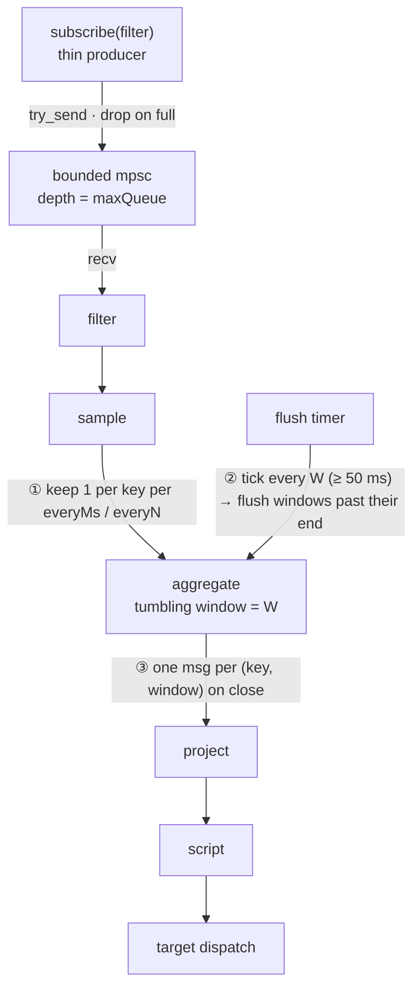

# Explanation — How the Telemetry Processor Works and Why

This page explains the ideas behind the processor so that the configuration options and the message
shapes make sense as a whole. If you only need a specific key or a step-by-step procedure, the
[reference](reference/) and the [how-to guides](how-to-guides.md) are quicker.

## What the component is for

Southbound protocol adapters (OPC UA, Modbus, …) publish every signal update to the **local bus** as a
`SouthboundSignalUpdate` envelope on the Unified-Namespace **`data`** class
(`ecv1/{device}/{component}/{instance}/data/{signalPath}` — see the
[southbound contract](#what-it-consumes-and-emits)). That telemetry is high-rate and edge-local, and
a raw firehose to the cloud is the wrong shape: integrators want to **filter** (drop BAD quality or
uninteresting signals), **downsample** (1 kHz → 1 Hz), and **aggregate** (per-signal windowed
min/max/avg) *before* the data leaves the device — and then route each result to the right place.

> **A "signal" is one southbound data point** — an OPC UA node, a Modbus register, … — carried in
> `body.signal` with its readings in `body.samples[]`. It is what the OPC UA / historian world calls a
> "tag"; the edgecommons contract names it a **signal** so the word "tag" is free for the message-envelope
> metadata (`tags`). The two are unrelated — see [the terminology
> note](reference/messaging-interface.md#envelope-tags-vs-the-signal).

The Telemetry Processor is that stage: the high-throughput northbound seam between the adapters and
the cloud. It is the reference **Rust processing component** (`com.mbreissi.edgecommons.TelemetryProcessor`),
built on the `edgecommons` Rust library. Like the adapters, it is deliberately thin — configuration, the
messaging transport, the durable streaming buffer, metrics, and lifecycle all come from `edgecommons`,
so the component contains only the processing engine and the target dispatch. It subscribes to the
fleet's `data`-class telemetry, runs a declarative per-route pipeline, and forwards the result onward.
Its **data path** is one-way transform-and-forward — but it is a full UNS/console citizen: the library
gives it the automatic `state` keepalive, `cfg` publisher, and a `cmd` inbox, and it adds its own
control verbs (`get-stats` / `flush` / `pause` / `resume`), `evt` health events, and a `metric/pipeline`
throughput metric.

## One route, one worker

The organizing principle is that **each `component.instances[]` entry is one route** — the direct
analogue of an adapter's "one server is one instance". A route owns its subscribe filters, its
pipeline, its target, and its own thread of control. A single deployment can run a dozen independent
routes simply by listing a dozen instances; cross-route `component.global.defaults` (`key` and a
default `target`) are overlaid onto each route (`global ⊕ instance`, the instance winning).

Each route runs **one async worker task**. The worker owns all of the pipeline's stateful data —
per-key sample timers, open aggregation windows — so that state lives in exactly one place and needs
no locks. The worker is a `tokio::select!` over two arms: a bounded `mpsc` channel of incoming
messages, and a flush timer. The subscribe callback is a **thin producer**: it parses nothing, it
just `try_send`s the message into the channel and returns. Because stateful stages require per-key
order, the subscription is opened with concurrency `1`, and a full channel **drops at the edge** (a
debug log, not backpressure into the broker) — so for strict no-loss you size `maxQueue` generously
and prefer a durable `stream:` target for the output.

**Shared-filter fan-out.** `edgecommons` keys subscriptions by their topic *filter*, so two routes that
subscribe the same filter cannot each open their own subscription. The app handles this by collecting
every route's resolved filters, subscribing each **unique** filter exactly once, and giving that one
subscription a handler that fans each arriving message out to *every* route channel that registered
it. Multiple routes can therefore share a topic — one does a 1 Hz downsample to the bus while another
windows the same stream into a durable archive — without colliding. Filters are MQTT filters: `+`/`#`
wildcards are allowed, and each is run through `edgecommons`' template resolver so `{ThingName}`,
`{ComponentName}`, and `tags` keys expand against the active config before subscribing. The fleet
consumer is the single UNS wildcard `ecv1/+/+/+/data/#` (scope it per adapter with
`ecv1/+/opcua-adapter/+/data/#`). Because the processor also republishes onto the `data` class it
consumes, a **self-echo guard** (identity restamp on `local` output + a drop of any re-consumed
own-identity message) keeps a `local` route from looping.

## Inside a route: the pipeline stages

A route's `pipeline` is an ordered list of stages. Every stage implements one internal `Processor`
seam — `process(msg)` returns 0..N output messages, and `on_tick(now)` lets a stateful stage emit on
the flush timer — so the built-ins and the Rhai stage compose uniformly and run strictly in the order
you write them. Output from an upstream stage (including a windowed flush) flows downstream through
the later stages' `process`.

| Stage | What it does | Stateful? |
|---|---|---|
| `filter` | Keep or drop the whole message. Three forms, checked in order: a Rhai/Lua boolean `script` (per the route's `scriptEngine`); a `quality` shorthand (keep only when **every** `samples[].quality` equals the value and at least one sample exists); or a built-in `field` + `op` + `value` predicate over a dotted path. `[]` in a path spreads an array → an **any-element** match. Ops: `eq` `ne` `gt` `lt` `ge` `le` `exists` `contains`. Built-ins compile to a fixed closure at startup — no per-message parsing. | no |
| `sample` | Per-key downsampling: keep one message per `everyMs` time window, or one in every `everyN`. The key path is `by`, falling back to the route key (`body.signal.id`). | yes (per key) |
| `aggregate` | Tumbling-window reduction. The window is time (`"10s"`, `"500ms"`) or a bare count (`"100"`); state is keyed by `by`/route key; the folded value is `value` (default `body.samples[].value`); reducers are `avg` `max` `min` `sum` `count` `first` `last`. Emits one `ProcessedTelemetry` message per `(key, window)` when the window closes. | yes (per key) |
| `project` | Reshape the body: `keep` a whitelist of **top-level** body keys (the first segment of each dotted path — so `keep: ["signal.id"]` retains the whole `signal` object), and/or `set` literal fields onto the body. | no |
| `script` | A Rhai or Lua program (inline or from a file) that returns a new body map, or a "nothing" value to drop the message. Its scope exposes `topic`, `header`, `body`, `tags`, `identity` (the source publisher's UNS identity), `samples`, and the conveniences `value`/`quality`. The **multi-signal form** declares named `inputs` (cached latest values across independent signals, evaluated on change with an `inputs`/`trigger` scope) and an optional `output` topic that publishes each result as a new envelope. See [Scripting](#scripting). | no (multi-signal form: yes — per-device input cache) |

Rhai is **always compiled in** — there is no feature gate, and the runtime cost is negligible when no
route uses a script. One engine is shared by every `filter`/`script` stage, bounded to a million
operations per evaluation so a runaway script cannot wedge a worker. A Rhai error (compile-time is
caught at startup; runtime errors) drops the message rather than crashing the route.

## Scripting

The built-in stages cover the common shapes — quality gating, value thresholds, downsampling,
windowed reduction, whitelisting. **Scripting is the escape hatch** for logic they don't express:
a derived engineering unit, a conditional drop, a reshape of a bespoke payload, a predicate that
spans several samples or inspects an array. The processor embeds **two engines**, selected per route
with `scriptEngine`: **[Rhai](https://rhai.rs)** (pure-Rust, always compiled in, the default) and
**Lua 5.4** (mature and widely known, available under the `scripting-lua` build). Either way a script
is compiled **once at startup**, sandboxed, and bounded, so it can shape data but can't reach outside
the pipeline.

Scripting appears in **three roles**, all backed by the same scope:

- a **`filter` `script`** — a predicate; a truthy result keeps the message (it fails *closed* — an
  error drops).
- a **`script` stage** — a transform that returns the **new body**, or a "nothing" value (`()` in
  Rhai, `nil` in Lua) to **drop** the message.
- a **multi-signal `script` stage** — the same transform contract computed over **several
  independent signals**: the stage caches the latest value of each named input and re-runs the
  script whenever one changes, binding the snapshot as `inputs` and the firing input as `trigger`;
  with an `output` topic the result becomes a **new derived signal** rather than an edit of the
  triggering message.

A script sees the **message view** (`topic`, the `header`/`body`/`tags` maps, the source publisher's
`identity`, `samples`, and the first-sample conveniences `value`/`quality`) plus the **runtime
context** (`thingName`, `componentName`, `componentFullName`, `routeId`, `recvMs`) so a generic,
reusable script can branch on which component/route/thing it runs in, or on the source device/adapter
(`identity.device` / `identity.component`). A script itself holds **no state** — each evaluation is
a pure function of its bindings; cross-message state belongs to the stages (`sample`, `aggregate`,
and the multi-signal `script` stage's input cache). Array-valued fields arrive as native arrays, so
a script can iterate/reduce over them like any collection.

> **Scripting has its own guide.** The dedicated **[Scripting page](scripting.mdx)** is the full
> treatment: every scope binding, return and error semantics, a Rhai language primer (functions,
> loops, ranges, `switch`, array methods), array handling, and a **cookbook of worked examples**
> (derived units, array mean/peak/RMS, rate-of-change, reusable identity-stamping, payload
> normalization, status mapping) — each explained goal → how → why, and each backed by a test.

## The two flows: from adapter to cloud



A consumer of low-rate control or alarm data subscribes northbound on IoT Core; a bulk-telemetry data
lake reads from the durable stream's sink. The processor decides, per route, which of those a given
slice of telemetry belongs on — that is the whole point of the stage.

## The processing-and-timing pipeline (the thing most worth understanding)

A message does not pass through a route in one step, and the route has **three independent timing
controls**. Confusing them is the single most common source of "why is my data too coarse, too fine,
or arriving late" problems.



**Sampling decides resolution (①).** The `sample` stage is per key: with `everyMs` it keeps the first
message it sees for a key, then drops everything for that key until the interval has elapsed; with
`everyN` it keeps one message in every N. It is the processor-side throttle for a chatty source — turn
a 1 kHz signal into a 1 Hz one before anything downstream has to carry the volume.

**Windowing decides granularity (②).** The `aggregate` stage buckets each key's samples into
**tumbling** windows and folds their `value`s with the configured reducers. A **time** window is
computed from each message's *receive* time — `[ floor(recv/W)·W , +W )` — so a 10 s window groups all
samples that landed in the same wall-clock 10 s slot. A **count** window simply collects N folded
sample values (each `body.samples[].value`, arrays folded element-wise — so N messages only when each
message carries a single scalar sample).
Note that windowing keys off the broker-receive time, not the sample's `sourceTs`.

**The flush tick decides when a time window actually emits (③).** The worker's timer is what closes a
time window. Its cadence is derived from the pipeline itself: it equals the **smallest aggregate time
window** in the route (floored at 50 ms); if the route has no time-windowed aggregate, the timer ticks
hourly and does nothing. So for a single time aggregate, **the window size and the flush cadence are
the same knob** — a `"10s"` window both defines the bucket and the tick that closes it. On each tick
the stage flushes every window whose end has passed (`window_end <= now`) and emits one message per
`(key, window)`.

Two details follow from this and are worth internalizing. First, a time window can also close
**eagerly**, without waiting for the tick: when a message for a *newer* window arrives for a key, the
prior window for that key is emitted immediately. So a steady stream self-flushes; the timer exists to
close windows for keys that have gone quiet. Second, **count windows need no timer at all** — they
close synchronously inside `process` the moment the Nth folded value arrives (= the Nth message only
when each message carries a single scalar sample).

The running worker derives its flush tick from the aggregate window as described above — there is no
separate flush-cadence knob. For lossless aggregation, size `maxQueue`
generously and route the output to a `stream:` target — the in-memory channel is drop-on-full, but the
streaming buffer is durable. On a clean shutdown the worker does a **final flush** so any open windows
are emitted before exit, so a graceful stop loses no in-flight aggregate.

## What it consumes and emits

The processor **consumes** the cross-language southbound envelope, header `name =
"SouthboundSignalUpdate"` (§7 of the southbound contract). The envelope is `header` + `identity` (the
source publisher's UNS identity — device/component/instance) +
`tags` (`appId`, `site`, `shop`, `line`) + `body`, where the body is
`{ device:{ adapter, instance, endpoint }, signal:{ id, name, address }, samples:[ { value, quality,
qualityRaw, sourceTs, serverTs } ] }`. `quality` is normalized to `GOOD`/`BAD`/`UNCERTAIN` with the
native code preserved in `qualityRaw`; `signal.id` is the stable canonical key the cloud routes on.
The stages read this shape directly — `filter` gates on `samples[].quality`, `aggregate` folds
`samples[].value`, the route/partition key defaults to `body.signal.id`.

But the shape is a **default, not a requirement** — the processor is payload-agnostic. Any JSON body
that matches a route's `subscribe` filter flows through, and every southbound assumption is
overridable: a `filter` `field`/`script` reads your own paths, the route `key` and the aggregate
`value` path point at any field, and the file sink's [rows projection](#targets-and-the-file-sink)
can be declared column-by-column. A payload that is *not* southbound-shaped is never rejected — with
the defaults, the aggregate stage folds the whole body as one value.

`filter`, `sample`, `project`, and `script` preserve the envelope (filter passes it untouched; project
and script rewrite the body) — except a multi-signal `script` with an `output`, which mints a fresh
`ScriptResult` envelope produced by the processor itself. The `aggregate` stage is the other one that
**emits a new message shape**,
`ProcessedTelemetry`: it reuses the first message of the window as the base (so the envelope `tags` and
the source `signal` carry through) and rewrites the body to

```json
{ "signal": { ... },
  "samples": [ { "value": <primary>, "quality": "GOOD" } ],
  "agg": { "avg": ..., "max": ..., "count": ... },
  "window": { "startMs": ..., "endMs": ..., "count": ... } }
```

The `samples[0].value` carries the **primary** reducer — the *first-listed* `fn` — so a downstream
file sink in rows mode always lands a value column; the full reducer set lives under `agg`, and
`window` records the bucket. Because the output is still a southbound-compatible envelope, a consumer
parses a rollup exactly like any other signal update.

## Targets and the file sink

A route forwards its output to exactly one target, and every target reuses an existing `edgecommons`
API — the net-new code is only the dispatch glue.

| `target` | What happens | QoS / key |
|---|---|---|
| `local` | Republish the processed message on the local bus, on `publish.topic` (resolved at startup) or the source topic. Its `identity` is **restamped** to the processor (loop-safety + provenance). | — |
| `northbound` | Publish to AWS IoT Core / a northbound MQTT broker. | `publish.qos`: `atLeastOnce` (default) or `atMostOnce` |
| `stream:<name>` | Append to the named durable `edgecommons` stream, which exports to its configured sink — Kinesis, Kafka, or **file**. | partition key from `publish.partitionKey`, default the route key (`body.signal.id`) |

The stream's sink is configured in the `streaming` section, not on the route, so a route forwards to
`stream:archive` and the `archive` stream decides where the bytes land. (Stream targets require the
component's `streaming` feature; built without it, a stream target drops with a warning.)

**The file sink** is a shared `edgestreamlog` capability, so a file destination is a normal stream sink
that inherits the durable buffer and at-least-once export. It writes **rolling Parquet (default) or
AVRO** files in one of two modes. **`rows`** mode flattens telemetry into normalized, typed rows —
query-ready for a lakehouse. Its **default projection** decodes each `SouthboundSignalUpdate` into one
row per sample (the envelope `tags` as a single JSON column, the `signal`/`device` identity, and a
sparse typed value column); a non-southbound payload is *never dropped* but routed to a sibling
`_unmapped` raw file. A **declared projection** (a `rows` config block) instead lands your own columns
from arbitrary paths — payload-agnostic, no southbound assumption. **`raw`** mode keeps one opaque row
per message for archival or replay. Files roll on size (`maxFileBytes`) or time (`rollEverySecs`), and
`maxFiles` caps the on-disk ring.

Two properties matter when you tune it. First, **`maxFileBytes` is a soft cap**: it is evaluated at
row-group granularity, so a finalized file can exceed it by up to one row group plus the Parquet
footer — set `batch.maxBytes` comfortably below `maxFileBytes` if you need tight files. Second, the
**durability** is at-least-once and the crash semantics differ by format: a clean shutdown finalizes
the open file (no loss); after a hard crash, **AVRO recovers to its last sync block** while **Parquet
discards the unclosed, footer-less file** (loss bounded by the open-file window — keep `rollEverySecs`
small, or prefer AVRO, when that matters). Because re-delivery after a crash can duplicate records,
**de-duplicate downstream on `(signalId, sourceTs)`**.

## A note on lifecycle and what isn't here

The processor reads its config **once at startup**, wires every route, and subscribes. On SIGTERM or
Ctrl-C it unsubscribes each filter, closes the route channels (so each worker drains and does its
final aggregate flush), waits for the workers to finish, and tears down by RAII. There is **no live
route hot-reload** — a config change needs a restart — and the component does **not** emit a
`processor_health` metric. Those are the two things the
mental model should *not* assume exist.
